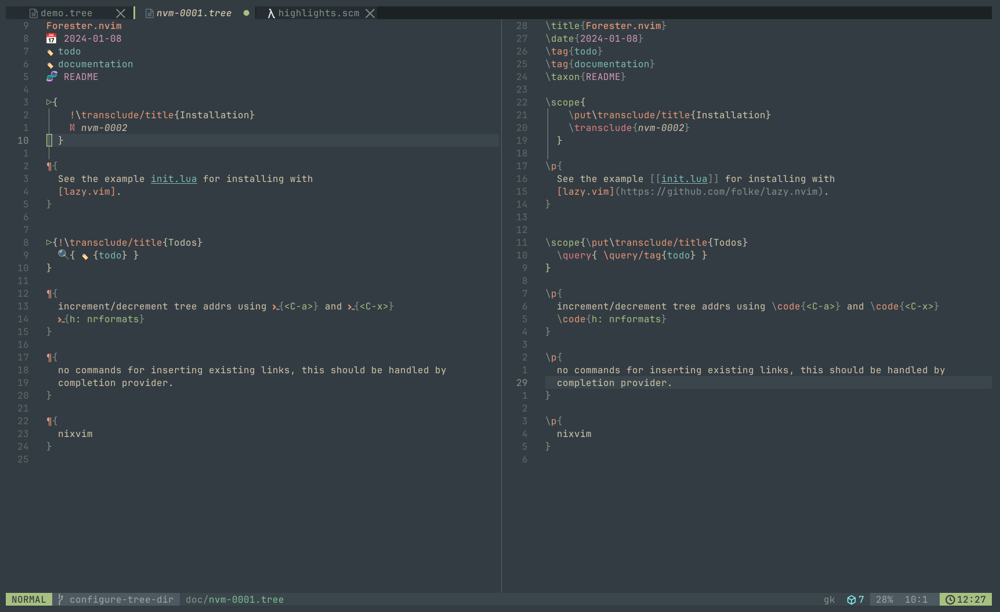

# forester.nvim

Filetype plugin for [forester](https://sr.ht/~jonsterling/forester/), a tool
for writing mathematical hypertext

## Installation

Install [forester](https://git.sr.ht/~jonsterling/ocaml-forester) either via
opam or nix.

With lazy:

```lua
  {
    "kentookura/forester.nvim",
    opts = {
      forests = { "~/forest/"}, -- global forests
      tree_dirs = {"trees", "notes"} -- where the plugin will look for trees. Works outside of global forests
      conceal = true;
    };
    config = function()
      local forester = require("forester")
      vim.g.mapleader = " "

      vim.keymap.set("n", "<leader>n.", "<cmd>Forester browse<CR>", { silent = true })
      vim.keymap.set("n", "<leader>nn", "<cmd>Forester new<CR>", { silent = true })
      vim.keymap.set("i", "<C-t>", "<cmd>Forester transclude<CR>", { silent = true })
      vim.keymap.set("i", "<C-l>", "<cmd>Forester link<CR>", { silent = true })
    end,
    dependencies = {
      { "nvim-treesitter/nvim-treesitter" },
      { "nvim-lua/plenary.nvim" },
      { "hrsh7th/nvim-cmp" },
    },
  },
```

## Features

- Tree-sitter syntax highlighting and concealing



  Note: The tree-sitter grammar is implemented independently from the parser that is part of `forester`.
  Please report any issues with the grammar in the [grammar repository](https://github.com/kentookura/tree-sitter-forester)

- following links and transclusions with `gf`

- Browsing forests with telescope

- Creating new trees within neovim

## Roadmap

- Adding more telescope pickers and previewers, making use of the `forester query` commands
- improving syntax highlighting and concealing
